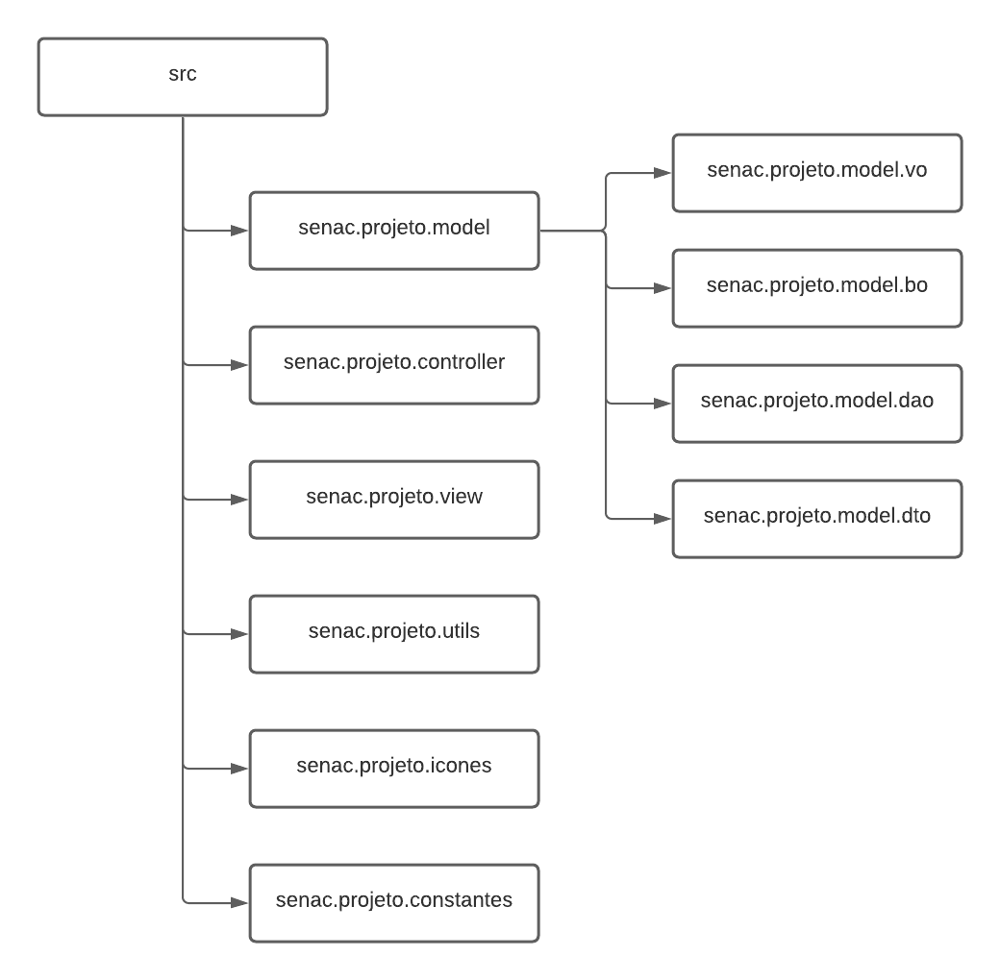
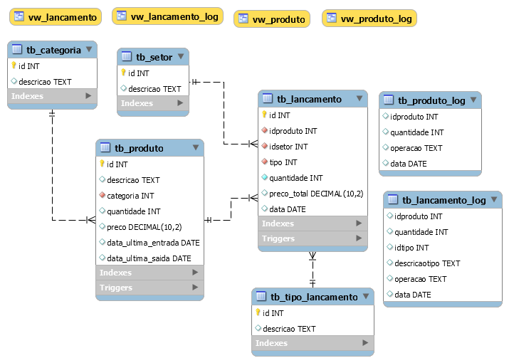
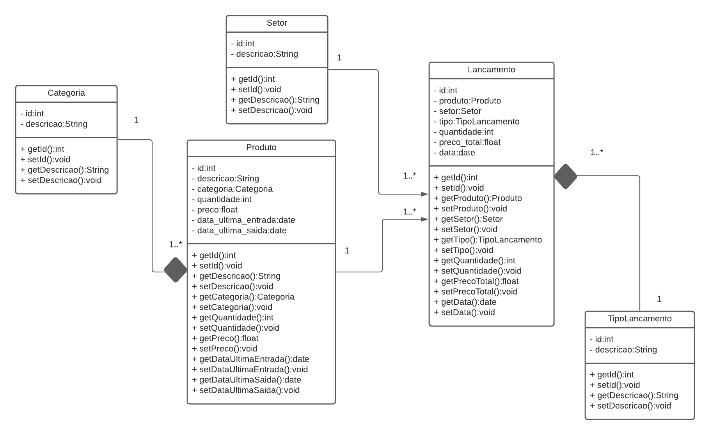

# Projeto Final Senac - Disciplina de Desenvolvimento de Software (2020/2)

### A tarefa

A tarefa consiste em desenvolver uma aplicação utilizando os assuntos que
abordamos durante o semestre. Utilizaremos a linguagem de programação JAVA e
a arquitetura de projeto MVC. Para as telas utilizaremos o Java Swing.

### A equipe

- [Guilherme V. de Andrade](https://github.com/amazingbits)
- [Jadson dos Santos Silva](https://github.com/jadson179)

### O projeto

Para abstrairmos o que foi ensinado durante o semestre, decidimos desenvolver
uma pequena aplicação de controle de estoque. Ela será capaz de cadastrar
produtos e efetuar lançamentos.

### O quê precisa ser construído?

- [x] Requisitos funcionais e não funcionais
- [x] Modelos das entidades do banco de dados
- [x] Diagrama de classes
- [x] Construir as classes de entidade (VO)
- [x] Construir as classes de persistência (DAO)
- [x] Construir as classes de regra de negócio (BO)
- [x] Construir os controladores
- [x] Construir as telas (JPanel) separadamente e implementar suas regras
- [x] Construir a tela principal (JFrame) com o menu de navegação do sistema

### Regras de nomenclatura

- **Linguagem** - português brasileiro (questão didática).
- **Pacotes** - {empresa}.{nome do projeto}.{nome do pacote}. Ex: senac.financeiro.controller.
- **Classes** - Pascal case. Geralmente com o primeiro nome sendo um substantivo. Ex: UsuarioController.
- **Métodos** - Camel case. Geralmente começando com um verbo no infinitivo. Ex: cadastrarUsuario().
- **Constantes** - Uppercase separados por underline. Ex: MENSAGEM_PADRAO.
- **Variáveis** - Camel case. Ex: dataDeNascimento.

### Arquitetura



### Requisitos

- Cadastrar produtos
- Editar produtos
- Excluir produtos
- Listar produtos
- Adicionar lançamento (entrada e saída de produtos)
- Remover lançamento
- Informar últimas saídas
- Informar últimas entradas
- Arquitetura MVC
- Pelo menos duas telas de cadastro
- Pelo menos uma tela de listagem com filtragem dinâmica
- Linguagem Java no back-end
- Java Swing no front-end
- SGBD MySQL

### Modelo SGBD



```sql
drop database if exists db_estoque;
create database db_estoque;
use db_estoque;

-- CRIAÇÃO DAS ENTIDADES

-- CATEGORIAS
create table if not exists tb_categoria(
	id int not null auto_increment primary key,
    descricao text,
    ativo int default 0
);

-- SETORES
create table if not exists tb_setor(
	id int not null auto_increment primary key,
    descricao text,
    ativo int default 0
);

-- TIPOS DE LANÇAMENTO (ENTRADA E SAÍDA POR PADRÃO)
create table if not exists tb_tipo_lancamento(
	id int not null auto_increment primary key,
    descricao text
);

-- INSERÇÕES PADRÃO PARA TIPO DE LANÇAMENTOS
insert into tb_tipo_lancamento values (NULL, "Entrada");
insert into tb_tipo_lancamento values (NULL, "Saída");

-- PRODUTOS
create table if not exists tb_produto(
	id int not null auto_increment primary key,
    descricao text,
    categoria int not null,
    quantidade int default 0,
    preco numeric(10,2) default 0,
    data_ultima_entrada date default null,
    data_ultima_saida date default null,
    ativo int default 0,
    constraint fk_produto_categoria
    foreign key (categoria) references tb_categoria(id)
);

-- LANÇAMENTOS
create table if not exists tb_lancamento(
	id int not null auto_increment primary key,
    idproduto int not null,
    idsetor int not null,
    tipo int not null,
    quantidade int not null,
    preco_total numeric(10,2) default 0,
    data date,
    constraint fk_lancamento_tipo
    foreign key (tipo) references tb_tipo_lancamento(id),
    constraint fk_lancamento_produto
    foreign key (idproduto) references tb_produto(id),
    constraint fk_lancamento_setor
    foreign key (idsetor) references tb_setor(id)
);

-- LOG PARA OPERAÇÕES DOS PRODUTOS
create table if not exists tb_produto_log(
	idproduto int,
    quantidade int,
    operacao text,
    data date
);

-- LOG PARA OPERAÇÕES DOS LANÇAMENTOS
create table if not exists tb_lancamento_log(
	idproduto int,
    quantidade int,
    idtipo int,
    descricaotipo text,
    operacao text,
    data date
);

-- =============================================================

-- VIEWS

-- RETORNA OS LOGS DOS PRODUTOS
create view vw_produto_log as
select 	tb_produto.descricao as produto,
        tb_produto_log.quantidade as quantidade,
        tb_produto_log.operacao as operacao,
        date_format(tb_produto_log.data, "%d/%m/%Y") as data,
        tb_produto_log.data as data_sql
from tb_produto_log
inner join tb_produto on
(tb_produto_log.idproduto = tb_produto.id)
order by tb_produto_log.data DESC;

-- RETORNA OS LOGS DOS LANÇAMENTOS
create view vw_lancamento_log as
select 	tb_lancamento_log.idproduto as codigoproduto,
		tb_produto.descricao as produto,
        tb_lancamento_log.descricaotipo as tipo,
        tb_lancamento_log.quantidade as quantidade,
        tb_lancamento_log.operacao as operacao,
        date_format(tb_lancamento_log.data, "%d/%m/%Y") as data,
        tb_lancamento_log.data as data_sql
from tb_lancamento_log
inner join tb_produto on
(tb_lancamento_log.idproduto = tb_produto.id)
order by data DESC;

-- RETORNA AS INFORMAÇÕES COMPLETAS DOS PRODUTOS
create view vw_produto as
select 	tb_produto.id as codigo,
		tb_produto.descricao as descricao,
        tb_produto.preco as preco,
        tb_categoria.descricao as categoria,
        tb_produto.quantidade as quantidade,
        date_format(tb_produto.data_ultima_entrada, "%d/%m/%Y") as ultima_entrada,
        date_format(tb_produto.data_ultima_saida, "%d/%m/%Y") as ultima_saida
from tb_produto
inner join tb_categoria on
(tb_produto.categoria = tb_categoria.id)
where tb_produto.ativo = 0
order by tb_produto.id desc;

-- RETORNA AS INFORMAÇÕES COMPLETAS DOS LANÇAMENTOS
create view vw_lancamento as
select 	tb_lancamento.id as codigo,
		tb_lancamento.idproduto as codigoproduto,
        tb_lancamento.preco_total as preco_total,
        tb_produto.descricao as produto,
        tb_setor.descricao as setor,
        tb_tipo_lancamento.descricao as tipo,
        tb_lancamento.quantidade as quantidade,
        date_format(tb_lancamento.data, "%d/%m/%Y") as data,
        tb_lancamento.data as data_sql
from tb_lancamento
inner join tb_produto on
(tb_lancamento.idproduto = tb_produto.id)
inner join tb_setor on
(tb_lancamento.idsetor = tb_setor.id)
inner join tb_tipo_lancamento on
(tb_lancamento.tipo = tb_tipo_lancamento.id)
order by tb_lancamento.id desc;

-- RETORNA OS PRODUTOS MAIS COMPRADOS
create view vw_produtos_mais_comprados as
select 	sum(tb_lancamento.quantidade) as qtd,
		tb_produto.descricao as des
from tb_lancamento
inner join tb_produto on
(tb_lancamento.idproduto = tb_produto.id)
where tb_lancamento.tipo = 1
group by tb_produto.descricao
order by qtd desc;

-- RETORNA OS PRODUTOS MAIS USADOS
create view vw_produtos_mais_usados as
select 	sum(tb_lancamento.quantidade) as qtd,
		tb_produto.descricao as des
from tb_lancamento
inner join tb_produto on
(tb_lancamento.idproduto = tb_produto.id)
where tb_lancamento.tipo = 2
group by tb_produto.descricao
order by qtd desc;


-- TRIGGERS
DELIMITER $$

-- VERIFICAÇÕES ANTES DE INSERIR UM NOVO PRODUTO
create trigger tg_tb_produto_bi before insert on tb_produto for each row
begin
	declare vProduto int;

    select count(*) into vProduto from tb_produto where tb_produto.id = new.id;

    -- VERIFICAR QUANTIDADE EM ESTOQUE
    if(vProduto > 0) then
		signal sqlstate "45000" set message_text = "Este produto já existe no banco de dados!";
    end if;

end $$

-- VERIFICAÇÕES APÓS INSERIR UM NOVO PRODUTO
create trigger tg_tb_produto_ai after insert on tb_produto for each row
begin
	-- ATUALIZAR LOG DO PRODUTO COM A NOVA INSERÇÃO
	insert into tb_produto_log values (new.id, new.quantidade, "Inserção", NOW());
end $$

-- VERIFICAÇÕES APÓS DELETAR UM PRODUTO
create trigger tg_tb_produto_ad after delete on tb_produto for each row
begin
	-- ATUALIZA O LOG COM A NOVA EXCLUSÃO
	insert into tb_produto_log values (old.id, old.quantidade, "Remoção", NOW());
end $$

-- VERIFICAÇÕES ANTES DE ATUALIZAR UM PRODUTO
create trigger tg_tb_produto_au after update on tb_produto for each row
begin

    if(new.ativo = 1) then
		insert into tb_produto_log values (old.id, old.quantidade, "Exclusão", NOW());
    elseif(old.descricao <> new.descricao) then
		insert into tb_produto_log values (old.id, old.quantidade, "Alteração", NOW());
    elseif(old.descricao = new.descricao and new.ativo = 0) then
		insert into tb_produto_log values (old.id, old.quantidade, "Inserção", NOW());
    end if;


end $$


create trigger tg_tb_lancamento_bi before insert on tb_lancamento for each row
begin
	declare vQuantidadeEstoque int;
    declare vTipoLancamento int;
    declare vQuantidadeAtual int;
    declare vDescricaoTipo text;
    declare vValorTotal numeric(10,2);
    declare vValorProduto numeric(10,2);

    select preco into vValorProduto from tb_produto where id = new.idproduto;
    set vValorTotal = new.quantidade * vValorProduto;
    set new.preco_total = vValorTotal;

    select descricao into vDescricaoTipo from tb_tipo_lancamento where id = new.tipo;

    select quantidade into vQuantidadeEstoque from tb_produto where id = new.idproduto;

    set vTipoLancamento = new.tipo;

    if(vTipoLancamento = 2 and new.quantidade > vQuantidadeEstoque) then
		signal sqlstate "45000" set message_text = "Não há quantidade suficiente em estoque!";
    end if;

    if(vTipoLancamento = 1) then
		set vQuantidadeAtual = vQuantidadeEstoque + new.quantidade;
        update tb_produto set data_ultima_entrada = NOW() where id = new.idproduto;
    else
		set vQuantidadeAtual = vQuantidadeEstoque - new.quantidade;
        update tb_produto set data_ultima_saida = NOW() where id = new.idproduto;
    end if;

    update tb_produto set quantidade = vQuantidadeAtual where id = new.idproduto;
    insert into tb_lancamento_log values (new.idproduto, new.quantidade, new.tipo, vDescricaoTipo, "Inserção", NOW());

end $$

create trigger tg_tb_lancamento_ad after delete on tb_lancamento for each row
begin
	declare vQuantidadeEstoqueAtual int;
    declare vQuantidadeEstoque int;
    declare vDescricaoTipo text;

    select descricao into vDescricaoTipo from tb_tipo_lancamento where id = old.tipo;

    select quantidade into vQuantidadeEstoqueAtual from tb_produto where id = old.idproduto;
    set vQuantidadeEstoque = vQuantidadeEstoqueAtual + old.quantidade;
    update tb_produto set quantidade = vQuantidadeEstoque where id = old.idproduto;
    insert into tb_lancamento_log values (old.idproduto, old.quantidade, old.tipo, vDescricaoTipo, "Remoção", NOW());
end $$

DELIMITER ;

-- INSERÇÕES PARA TESTES --

-- CATEGORIAS
insert into tb_categoria values (NULL, "Escritório", 0);
insert into tb_categoria values (NULL, "Informática", 0);
insert into tb_categoria values (NULL, "Equipamento", 0);
insert into tb_categoria values (NULL, "Medicação", 0);
insert into tb_categoria values (NULL, "Insumos", 0);
insert into tb_categoria values (NULL, "Materiais", 0);
insert into tb_categoria values (NULL, "Eletrônicos", 0);
insert into tb_categoria values (NULL, "Perecíveis", 0);
insert into tb_categoria values (NULL, "Demais Itens", 0);
insert into tb_categoria values (NULL, "Farmácia", 0);
insert into tb_categoria values (NULL, "CCIH", 0);
insert into tb_categoria values (NULL, "Portaria", 0);
insert into tb_categoria values (NULL, "Obras", 0);
insert into tb_categoria values (NULL, "Documentos", 0);

-- SETORES
insert into tb_setor values (NULL, "Escritório", 0);
insert into tb_setor values (NULL, "Informática", 0);
insert into tb_setor values (NULL, "RH", 0);
insert into tb_setor values (NULL, "Tesouraria", 0);
insert into tb_setor values (NULL, "Direção", 0);
insert into tb_setor values (NULL, "Marketing", 0);
insert into tb_setor values (NULL, "Telefonia", 0);
insert into tb_setor values (NULL, "Atendimento", 0);
insert into tb_setor values (NULL, "Obras", 0);
insert into tb_setor values (NULL, "Nutrição", 0);
insert into tb_setor values (NULL, "CCIH", 0);
insert into tb_setor values (NULL, "Raio-X", 0);
insert into tb_setor values (NULL, "Cardiologia", 0);
insert into tb_setor values (NULL, "Ambulatório", 0);
insert into tb_setor values (NULL, "Emergência", 0);
insert into tb_setor values (NULL, "Medicação", 0);
insert into tb_setor values (NULL, "UTI", 0);
insert into tb_setor values (NULL, "Isolamento", 0);
insert into tb_setor values (NULL, "Internação", 0);
insert into tb_setor values (NULL, "Farmácia", 0);
insert into tb_setor values (NULL, "Bioquímica", 0);
insert into tb_setor values (NULL, "Infectologia", 0);
insert into tb_setor values (NULL, "Laboratório", 0);
insert into tb_setor values (NULL, "Portaria", 0);

-- PRODUTOS
insert into tb_produto values (null, "Papel A4", 1, 10, 15.0, null, null, 0);
insert into tb_produto values (null, "Caneta", 1, 10, 8.0, null, null, 0);
insert into tb_produto values (null, "Postite", 1, 10, 2.50, null, null, 0);
insert into tb_produto values (null, "Cola Bastão", 1, 10, 9.0, null, null, 0);
insert into tb_produto values (null, "Clips", 1, 10, 0.8, null, null, 0);

insert into tb_produto values (null, "Memória RAM 4Gb", 2, 10, 150.0, null, null, 0);
insert into tb_produto values (null, "SSD 128Gb", 2, 10, 199.0, null, null, 0);
insert into tb_produto values (null, "Pasta Térmica", 2, 10, 15.0, null, null, 0);
insert into tb_produto values (null, "Monitor 28'", 2, 10, 680.0, null, null, 0);
insert into tb_produto values (null, "Fonte 12v", 2, 10, 39.0, null, null, 0);

insert into tb_produto values (null, "Planilha 3D", 3, 10, 159.0, null, null, 0);
insert into tb_produto values (null, "Laptop Samsung", 3, 3, 2599.0, null, null, 0);

insert into tb_produto values (null, "Becker", 4, 10, 158.0, null, null, 0);
insert into tb_produto values (null, "Seringa", 4, 10, 200.0, null, null, 0);
insert into tb_produto values (null, "Agulha", 4, 10, 159.0, null, null, 0);
insert into tb_produto values (null, "Esparadrapo", 4, 10, 150.0, null, null, 0);

-- ====================================================================================

use db_estoque;
select * from vw_produto;
select * from vw_produtos_mais_comprados LIMIT 5 OFFSET 0;
use db_estoque;

select * from vw_produto_log where month(data_sql) = 8;
 -- insert into tb_produto values (null, "Mouse", 1, 5, 18.50, now(), null);
 -- insert into tb_lancamento values (null, 1, 2, 2, 4, null, now());
 -- select * from vw_produto_log;
 -- select * from vw_lancamento_log;
 -- select * from vw_produto;
 -- select * from vw_lancamento;
```

### Diagrama de classe


